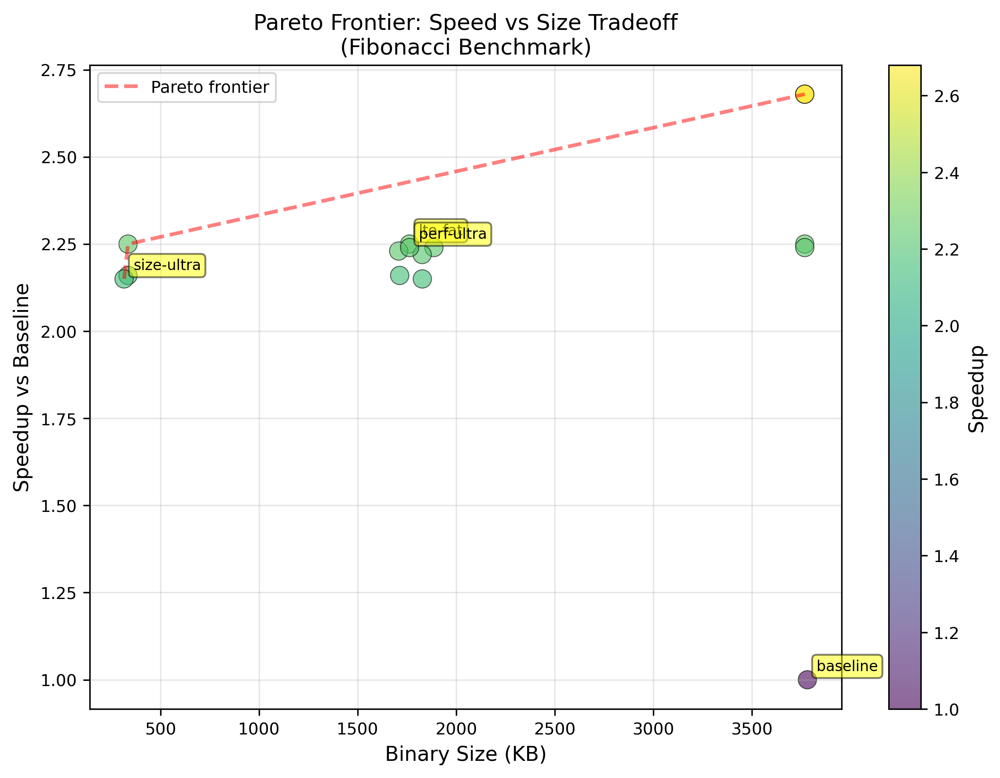

# Visualization Guide

**Purpose**: Guide for generating publication-ready visualizations from benchmark data

---

## Quick Start

### Install Required Packages

```bash
# Option 1: Using pip (if allowed)
pip3 install pandas matplotlib numpy

# Option 2: Using system package manager
sudo apt install python3-pandas python3-matplotlib python3-numpy  # Ubuntu/Debian
brew install python-matplotlib python-numpy python-pandas          # macOS

# Option 3: Using virtual environment
python3 -m venv venv
source venv/bin/activate
pip install pandas matplotlib numpy
```

### Generate All Visualizations

```bash
python3 generate_visualizations.py
```

**Output**: 5 PNG files in `visualizations/` directory (300 DPI, publication-ready)

---

## Visualizations Generated

### 1. Pareto Frontier: Speed vs Size
**File**: `visualizations/pareto_frontier.png`

**Shows**: Tradeoff between binary size and speedup

**Key Points Highlighted**:
- **lto-fat**: Best balance (2.25x speedup, 1.7 MB)
- **size-ultra**: Maximum size savings (2.16x speedup, 314 KB)
- **baseline**: Starting point (1.0x speedup, 3.8 MB)

**Pareto Frontier Line**: Red dashed line shows optimal configurations

**Insights**:
- 91.7% size reduction possible with only 4% speed penalty
- LTO provides both speed AND size improvements
- Clear optimal points visible

### 2. Heatmap: Benchmark × Profile Matrix
**File**: `visualizations/heatmap.png`

**Shows**: Speedup for every benchmark × profile combination

**Colors**:
- Dark red = High speedup (40-50x)
- Yellow = Moderate speedup (10-20x)
- Light yellow = Low speedup (2-5x)

**Patterns to Notice**:
- Quicksort row is darkest (51.33x max)
- File-io row is lightest (I/O bound)
- LTO columns tend to be darker

### 3. Profile Rankings with Confidence Intervals
**File**: `visualizations/profile_rankings.png`

**Shows**: Top 10 profiles ranked by average speedup across all benchmarks

**Colors**:
- 🥇 Gold: 1st place (lto-fat, 15.06x)
- 🥈 Silver: 2nd place (lto-thin, 14.47x)
- 🥉 Bronze: 3rd place (codegen-1, 14.08x)
- Blue: Others

**Error Bars**: 95% confidence intervals
- Wide bars indicate high variability across benchmarks
- Overlapping bars mean no significant difference

**Insight**: Top 5 profiles are statistically similar overall

### 4. Workload Comparison
**File**: `visualizations/workload_comparison.png`

**Shows**: Maximum speedup achieved for each benchmark with its optimal profile

**Colors**: Gradient from red (low) to green (high)

**Labels**: Show best profile for each workload

**Ranking** (fastest to slowest optimization potential):
1. quicksort (Memory-random): 51.33x with lto-fat
2. prime-sieve (CPU-iterative): 25.81x with perf-ultra
3. matrix-mult (Memory-cache): 22.64x with opt-s
4. ...
8. file-io (IO-bound): 1.99x with size-z-native

**Insight**: Memory-bound workloads benefit most from optimization

### 5. Combined Analysis (All in One)
**File**: `visualizations/combined_analysis.png`

**Layout**: 2×2 grid with all 4 plots
- (A) Pareto Frontier
- (B) Profile Rankings
- (C) Workload Comparison
- (D) Heatmap (subset showing 5 key profiles)

**Use Case**: Perfect for presentations or papers where space is limited

---

## Alternative: Text-Based Visualization

If matplotlib is not available, you can generate text-based visualizations:

```bash
# Simple bar chart in terminal
python3 << 'EOF'
import csv
with open('profile_rankings.csv') as f:
    reader = csv.DictReader(f)
    print("\nTop Profile Rankings:\n")
    for i, row in enumerate(list(reader)[:10], 1):
        speedup = float(row['mean_speedup'])
        bars = '█' * int(speedup)
        print(f"{i:2d}. {row['profile']:20s} {bars} {speedup:.1f}x")
EOF
```

---

## Data Files Used

All visualizations are generated from these CSV files:

1. **pareto_frontier.csv** (407 bytes)
   - Columns: profile, speedup, binary_size_kb
   - Rows: 15 (one per profile, fibonacci benchmark)

2. **heatmap_data.csv** (1.1 KB)
   - Columns: benchmark + 14 profiles
   - Rows: 10 benchmarks
   - Values: speedup ratios

3. **profile_rankings.csv** (534 bytes)
   - Columns: profile, mean_speedup, ci_lower, ci_upper, stddev
   - Rows: 14 profiles (sorted by speedup)

4. **workload_comparison.csv** (467 bytes)
   - Columns: benchmark, workload_type, max_speedup, best_profile
   - Rows: 10 benchmarks

---

## Customization

### Change Figure Size

Edit `generate_visualizations.py`:
```python
fig, ax = plt.subplots(figsize=(12, 8))  # Width, Height in inches
```

### Change DPI (Resolution)

```python
plt.rcParams['figure.dpi'] = 600  # Higher = better quality, larger file
```

### Change Color Schemes

```python
# Pareto scatter plot
cmap='viridis'  # Try: plasma, inferno, magma, cividis

# Heatmap
cmap='YlOrRd'   # Try: RdYlGn, Blues, Reds
```

### Export to Different Formats

```python
plt.savefig('visualizations/plot.pdf')    # Vector format (scalable)
plt.savefig('visualizations/plot.svg')    # SVG for web
plt.savefig('visualizations/plot.eps')    # For LaTeX papers
```

---

## Using Visualizations in Publications

### LaTeX

```latex
\begin{figure}[htbp]
  \centering
  \includegraphics[width=0.8\textwidth]{visualizations/pareto_frontier.png}
  \caption{Pareto frontier showing speed vs size tradeoff for Rust optimization profiles.
           LTO Fat achieves 2.25x speedup while reducing binary size by 53.4\%.}
  \label{fig:pareto}
\end{figure}
```

### Markdown/README

```markdown


**Figure 1**: Speed vs Size tradeoff. LTO Fat (blue) provides the best balance.
```

### PowerPoint/Presentations

- Right-click image → Copy
- Paste into slide
- Resize as needed (300 DPI ensures quality)

---

## Interpreting the Results

### Pareto Frontier Analysis

**Question**: Should I optimize for speed or size?

**Answer** (from the plot):
- **Pure speed**: Use codegen-1 or perf-ultra (2.68x, large binary)
- **Balanced**: Use lto-fat (2.25x, medium binary, -53% size)
- **Pure size**: Use size-ultra (2.16x, tiny binary, -92% size)

**Insight**: LTO provides both benefits simultaneously!

### Heatmap Analysis

**Question**: Which profile is best for my workload?

**Answer** (look at your benchmark's row):
- If you see dark red in lto-fat column → Use lto-fat
- If you see dark red in opt-s column → Use opt-s (cache-sensitive)
- If entire row is light → Optimization has limited impact (I/O bound)

### Profile Rankings Analysis

**Question**: Is there a clear winner?

**Answer** (from error bars):
- Top 5 profiles have overlapping CIs → No statistically significant difference overall
- **Recommendation**: Use lto-fat as default, but check workload-specific results

### Workload Comparison Analysis

**Question**: How much speedup can I expect?

**Answer** (from your workload type):
- Memory-bound random access: 40-50x possible
- CPU iterative: 20-30x possible
- CPU recursive: 5-6x possible
- I/O bound: 2x possible

---

## Troubleshooting

### "No module named 'pandas'"

```bash
# Install using virtual environment (recommended)
python3 -m venv venv
source venv/bin/activate
pip install pandas matplotlib numpy
python3 generate_visualizations.py
```

### "Matplotlib backend error"

```bash
# Use non-interactive backend
export MPLBACKEND=Agg
python3 generate_visualizations.py
```

### "Permission denied"

```bash
chmod +x generate_visualizations.py
./generate_visualizations.py
```

### Large File Sizes

```python
# Reduce DPI in script
plt.rcParams['figure.dpi'] = 150  # Default was 300
```

---

## Example Output

After running `python3 generate_visualizations.py`:

```
Generating visualizations...

1. Creating Pareto frontier (speed vs size)...
  ✓ visualizations/pareto_frontier.png
2. Creating heatmap (benchmark × profile performance)...
  ✓ visualizations/heatmap.png
3. Creating profile rankings with confidence intervals...
  ✓ visualizations/profile_rankings.png
4. Creating workload comparison...
  ✓ visualizations/workload_comparison.png
5. Creating combined visualization (all 4 plots)...
  ✓ visualizations/combined_analysis.png

============================================================
✅ All visualizations generated successfully!
============================================================

Files created in visualizations/:
  1. pareto_frontier.png       - Speed vs size tradeoff
  2. heatmap.png               - Benchmark × profile matrix
  3. profile_rankings.png      - Top profiles with CIs
  4. workload_comparison.png   - Best speedup by workload
  5. combined_analysis.png     - All 4 plots in one figure

All figures are publication-ready (300 DPI)
```

---

## Next Steps

Once visualizations are generated:

1. **Review** the plots to identify patterns
2. **Include** in documentation/reports
3. **Present** findings to team/stakeholders
4. **Publish** in papers/blog posts

The CSV data is also available for custom analysis in R, Excel, or other tools.

---

**Status**: Visualization script ready, requires pandas/matplotlib installation
**Alternative**: Use online tools like plotly, Google Sheets, or Excel to visualize CSVs
